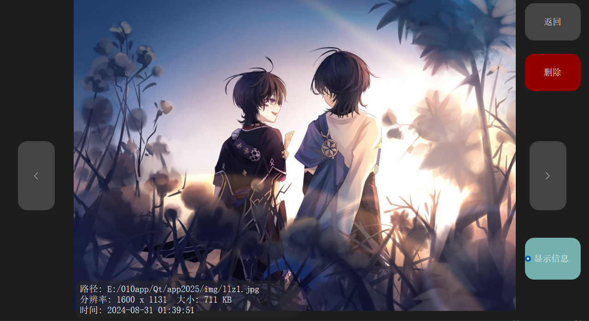
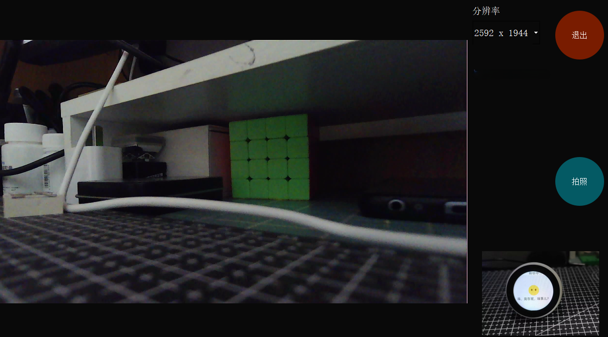
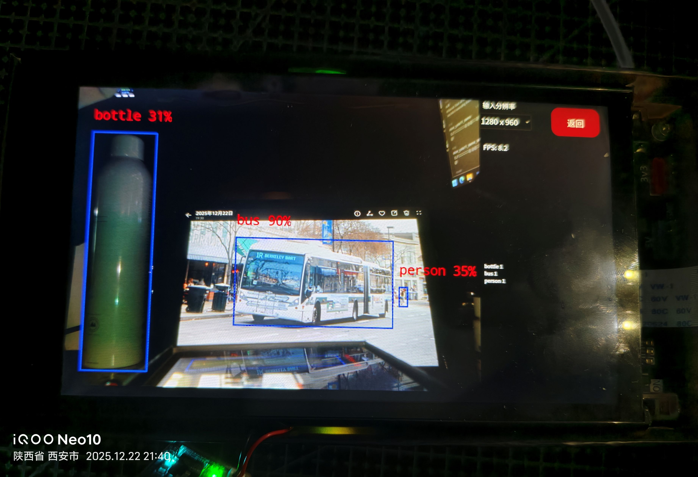
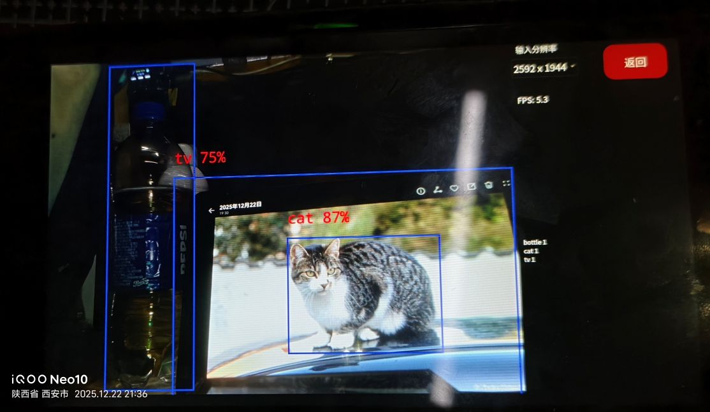

# Linux_Qt5_Camera
#### 此分支scr_6inch 适用于 6寸 & 固定分辨率1280x720

###  若不想编译，想在泰山派上直接体验，可以在执行完 2.0 后直接跳到 步骤 3 
## 1、Window编译方法
    使用VSCode或Qtcreater可直接编译（需要Qt环境搭建）
## 2、Linux交叉编译ARM版编译方法
    以泰山派RK3566+buildroot系统为例
    主机为VMware：Ubuntu22.04
## 2.0.buildroot添加Qt
### ！！！注意要用到项目 misc/conf 文件夹下图片上标明的的库，请在编译buildroot文件系统时勾选，添加Qt5参考立创开发板文章 
    https://wiki.lckfb.com/zh-hans/tspi-rk3566/documentation/transplant-qt5.html
### 2.1.获取工程+配置环境变量
    git clone https://github.com/HXBJ1737/Linux_Qt_app
    export ARCH=arm64
    export CROSS_COMPILE=aarch64-rockchip-linux-gnu-
    export PATH=$PATH:/home/hxbj/tspi/linux_sdk/prebuilts/gcc/linux-x86/aarch64/gcc-buildroot-9.3.0-2020.03-x86_64_aarch64-rockchip-linux-gnu/bin
    export LD_LIBRARY_PATH=$LD_LIBRARY_PATH:/home/hxbj/tspi/linux_sdk/prebuilts/gcc/linux-x86/aarch64/gcc-buildroot-9.3.0-2020.03-x86_64_aarch64-rockchip-linux-gnu/lib
    export PATH=$PATH:/home/hxbj/tspi/linux_sdk/buildroot/output/rockchip_rk3566/host/bin
    ## 注意路径换成自己的，并且后续操作使用这一个终端
### 2.2.交叉编译库文件libtouch
#### (tips：由于某种未知原因，泰山派(ARM Linux)打开照相机应用后需要手动触摸一下屏幕才会开始显示摄像头画面，先尝试用Qt自带的模拟触摸或鼠标事件，没用，故使用Linux的uinput产生系统级原生触摸事件，来模拟手动点击刷新)
#### 也可以直接使用我编译好的libtouch.so(位于项目linux_touch下)
    cd linux_touch
    make
    ## 如果步骤1操作成功，可以看到make后输出的编译器是aarch64-rockchip-linux-gnu-gcc ，不是gcc.
    cp libtouch.so ../

### 2.3.交叉编译此Qt项目
    cd ../      #cd到工程根目录
    qmake app2025.pro   #若提示找不到qmake，看步骤1配置环境变量。
    make
## 3、上传文件至ARM开发板（以泰山派为例）
### 3.1 方法一：编译进文件系统在重新烧录rootfs.img
    将项目中misc下的hxbj文件夹复制到linux_sdk/buildroot/output/rockchip_rk3566/target下
    (hxbj文件夹里面是我编译后的app2025和libtouch.so等和后面用到的一些文件,你可以换成你刚才编译的)
    
    cd 到你的LinuxSDK目录
    ./build.sh rootfs   
    # 然后重新烧录rootfs.img

### 3.2 方法二：直接上传至开发板
#### 我使用ADB，以此为例
    # 连上开发板,将项目misc文件夹下的hxbj文件夹上传至开发板根目录 /
    # (hxbj文件夹里面是我编译后的app2025和libtouch.so和后面用到的一些脚本,你可以换成你刚才编译的) 
    # 注意换成自己的路径
    # 以此为例，可将需要的文件的也上传到开发板
    #----以上为说明----
    adb push "Z:\Qt_projects\app2025\misc\hxbj" /

## 4.配置板端文件并运行
### 现在开发板hxbj目录下有这些文件
    QDesktop 正点原子例程可执行文件(可在 https://gitee.com/GuangzhouXingyi/imx6ull-qtdemo 自行下载编译)
    src      正点原子音视频图资源 
    +以上来源于正点原子项目
    lib      动态库目录
    wifi.conf     wifi配置文件（里面有wifi名和密码，自己改）
    app2025       此项目可执行文件
    img           相册存储目录（含演示图片）
    video         视频存储目录（含演示视频）————>TODO
    auto.sh       库文件自动复制+app2025启动+wifi连接 脚本
    quickconf.sh  桌面自动配置+自启动配置 脚本
    weston.ini        桌面配置文件
    rcS               自启动配置文件
    +以下为yolo11相关单独测试例程，
    model         rknn模型
    rknn_yolo11_demo(运行方法 ./rknn_yolo11_demo model/yolo11_relu.rknn model/bus.jpg)
    rknn_yolo11_demo_zero_copy(运行方法 ./rknn_yolo11_demo_zero_copy model/yolo11_relu.rknn model/bus.jpg)

### 4.1.配置桌面旋转方向与自启动
    adb shell
    cd /hxbj
    chmod +x quickconf.sh
    ./quickconf.sh # 可以自己看看这个文件里涉及的文件操作，便于自己更改。
    # 配置完会自动重启->修改为请手动重启
    #----------------------------------
    # 操作无误的话，以后开机会自启动Qt界面app2025并连接wifi（取决于wifi.conf中内容）
    #结束进程方法
    ps -aux #可选，查看运行中进程
    killall app2025
### 4.2.（可选）制作包含自启动的rootfs.img
    TODO
## 5.问题解答
### 5.1.摄像头无法显示。
    参考 https://hx.sn.cn/archives/L2R8QU6o 解决。（驱动问题）
### 5.2.运行无权限。
    chmod +x 文件名   
    #例如 chmod +x ./app2025
### 5.3.无法显示中文。
    方法1：在linux_sdk/buildroot/output/rockchip_rk3566/target/usr/share下创建fonts文件夹，然后复制字库文件夹到此文件夹，或在make menuconfig中选中source-han-sans-cn，重新编译rootfs.img,烧录至开发板。
    方法2：下载字库，上传至开发板的/usr/share/fonts目录（注意fonts目录可能不存在，先用 mkdir /usr/share/fonts创建。
## 欢迎讨论 
            个人QQ：2437224636
            Q Q 群：608996734

